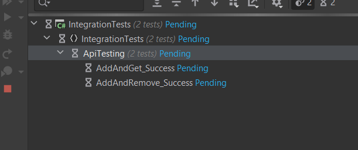
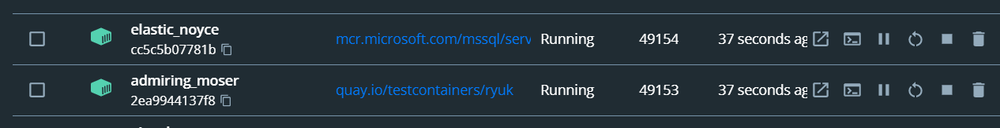

# IntegrationTestAndDockerDb

Example integration test for a simple **Minimalapi** using a library
[testcontainers-dotnet](https://github.com/isen-ng/testcontainers-dotnet)
It allows to create a database in the docker for the
test time. As for me, a great :)

<br />

> ### MinimalApi

Layers in the application 

- Presentation **IntegratioTestDbDocker**
- **Application**
- **Infrastructure**

Endpoints 

- **Post** <span style="color: aqua">'api/car'</span>
- **Get** <span style="color: aqua">'api/cars' downloading the list of added cars</span>
- **Delete** <span style="color: aqua">'api/car{carId}'</span>

```c#
app.MapPost("api/car", async (
    [FromForm] CarDto carDto,
    [FromServices] ICarService carService, 
    CancellationToken cancellationToken) =>
{
    var result = await carService.Add(
        carDto.Name,
        carDto.Brand,
        carDto.Horsepower,
        carDto.EngineCapacity,
        cancellationToken);
    return result.ToString();
});
app.MapGet("api/cars", async ([FromServices] ICarService carService, CancellationToken cancellationToken) =>
{
    var result = await carService.GetAll(cancellationToken);
    return result;
});
app.MapDelete("api/car", async (
    [FromBody] Guid carId,
    [FromServices] ICarService carService,
    CancellationToken cancellationToken) =>
{
    var resutl = await carService.Remove(carId, cancellationToken);
    return resutl;
});
```

<br />

> ### Integration test

To begin, for the test to work
need to create an **partial** class for the **Program**

```c#
...
public partial class Program { }
```

In class

```c# 
public class AppDbFixture<TStartup> : WebApplicationFactory<TStartup>, IAsyncLifetime
{
    public AppDbFixture() : base()
    {
        Container = new ContainerBuilder<MsSqlContainer>()
            .ConfigureDockerImageName("mcr.microsoft.com/mssql/server:2017-latest-ubuntu")
            .ConfigureDatabaseConfiguration("not-used", Password, "not-used")
            .ConfigureLogging(builder =>
            {
                builder.AddConsole();
                builder.SetMinimumLevel(LogLevel.Debug);
            })
            .Build();
    }
```

Exactly in the constructor we create **ContainerBuilder**.
And **start** and **delete** virtualization is done in the

```c#
    public async Task InitializeAsync()
        => await Container.StartAsync();

    public new async Task DisposeAsync()
        => await Container.StopAsync();```

```

The next step is just replacing **connectionString**, for **Api**.
Early only, you need to download the **mapped port** for the **data base** in **docker** and do the swap

```c#
protected override void ConfigureWebHost(IWebHostBuilder builder)
{
    builder.ConfigureServices(services =>
    {
        var port = Container.GetMappedPort(Container.ExposedPorts[0]);
        var descriptor = services
            .SingleOrDefault(d => d.ServiceType == typeof(DbContextOptions<ApplicationDbContext>));
        services.Remove(descriptor);
        services.AddDbContext<ApplicationDbContext>((options, context) =>
        {
            context.UseSqlServer($"Server=127.0.0.1,{port}; Database=IntegrationTestDbDocker; User Id={Username}; Password={Password};");
        });

    });
}
```

<br />

And get to work :D


